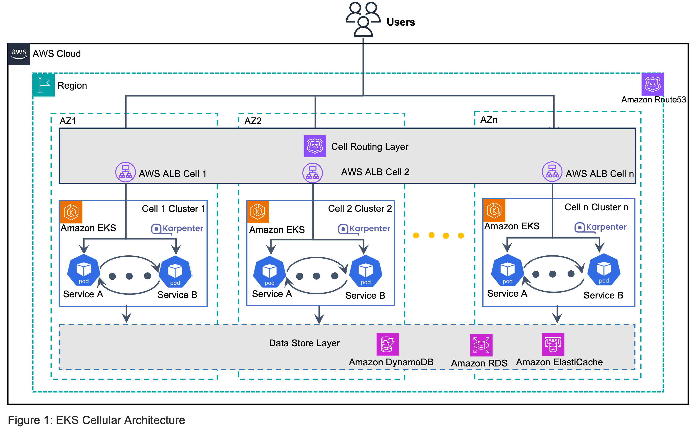

# Guidance for a Cell-Based Architecture for Amazon EKS on AWS

## Table of Contents

- [Guidance for a Cell-Based Architecture for Amazon EKS](#eks-cell-based-architecture-for-high-availability)
  - [Table of Contents](#table-of-contents)
  - [Overview](#overview)
  - [Features and Benefits](#features-and-benefits)
  - [Use cases](#use-cases)
  - [Architecture Overview](#architecture-overview)
  - [Architecture Diagram](#architecture-diagram)
  - [Architecture Steps](#architecture-steps)
  - [AWS Services and Components](#aws-services-and-components)
  - [Cost](#cost)
      - [Cost Optimization Considerations](#cost-optimization-considerations)
  - [Security](#security)
      - [Network Security](#network-security)
      - [Access Control](#access-control)
      - [Kubernetes Security](#kubernetes-security)
      - [Additional Security Considerations](#additional-security-considerations)
  - [Supported AWS Regions](#supported-aws-regions)
  - [Quotas](#quotas)
      - [Quotas for AWS services in this Guidance](#quotas-for-aws-services-in-this-guidance)
      - [Key Quota Considerations for Cell-Based Architecture](#key-quota-considerations-for-cell-based-architecture)
  - [Deployment Steps](#deployment-steps)
  - [Notices](#notices)
  - [Authors](#authors)
  - [Acknowledgements](#acknowledgements)

## Overview

The EKS Cell-Based Architecture for High Availability is a resilient deployment pattern that distributes Amazon EKS workloads across multiple isolated "cells," with each cell confined to a single Availability Zone (AZ). This architecture enhances application availability by eliminating cross-AZ dependencies and providing isolation boundaries that prevent failures in one AZ from affecting the others.

By deploying independent EKS clusters in each AZ and using intelligent traffic routing, this pattern creates a highly available system that can withstand AZ failures while maintaining application availability.

## Features and Benefits

- **AZ Isolation**: Each EKS cluster (cell) is deployed in a dedicated Availability Zone, eliminating cross-AZ dependencies and preventing cascading failures.

- **Independent Scaling**: Each cell can scale independently based on its specific load and requirements.

- **Intelligent Traffic Distribution**: Uses Route53 weighted routing to distribute traffic across cells, with automatic failover capabilities.

- **Reduced Blast Radius**: Failures in one cell don't impact others, limiting the scope of potential outages.

- **Optimized Latency**: Eliminates cross-AZ traffic for most operations, reducing latency and AWS data transfer costs.

- **Improved Deployment Safety**: Enables progressive rollouts across cells, reducing the risk of widespread deployment failures.

- **Cost Optimization**: Reduces cross-AZ data transfer costs by keeping traffic within AZs whenever possible.

- **Consistent Infrastructure**: Uses Terraform to ensure consistent configuration across all cells.

## Use cases

- **Mission-Critical Applications**: For applications that require extremely high availability and cannot tolerate even brief outages.

- **Microservice Architectures**: Complex microservice deployments that benefit from clear isolation boundaries.

- **High-Traffic Applications**: Consumer-facing applications that need to handle large traffic volumes with consistent performance and increased resilience.

- **Disaster Recovery Solutions**: As part of a comprehensive disaster recovery strategy with multiple fallback options.

## Architecture Overview

This section provides a reference implementation architecture diagram for the components deployed with this Guidance.

The cell-based EKS architecture consists of several key components working together to provide high availability:

1. **VPC Infrastructure**: A shared VPC with public and private subnets spanning three Availability Zones, providing the network foundation for the cells.

2. **EKS Cells**: Three independent EKS clusters (cell1, cell2, cell3), each deployed in a separate Availability Zone. Each cell includes:

    - An EKS cluster with managed node groups
    - Node instances confined to a single AZ
    - AWS Load Balancer Controller for managing ingress traffic
    - Karpenter for node auto-scaling

3. **Application Deployment**: Each cell hosts identical application deployments, ensuring consistent behavior across cells. The example uses simple NGINX containers, but this can be replaced with any containerized application.

4. **Ingress Layer**: Each cell has its own Application Load Balancer (ALB) created by the AWS Load Balancer Controller, with support for:

    - HTTPS termination using ACM certificates
    - Health checks to monitor application availability
    - Cross-zone load balancing disabled to maintain AZ isolation

5. **DNS-Based Traffic Distribution**: Route53 provides intelligent traffic routing with:

    - Weighted routing policy distributing traffic across all three cells (33/33/34% split)
    - Individual DNS entries for direct access to specific cells
    - Automatic health checks to detect cell failures

6. **Security Components**:

    - IAM roles and policies for secure cluster operations
    - Security groups controlling network access
    - HTTPS enforcement with TLS 1.3 support

This architecture ensures that if any single Availability Zone fails, traffic automatically routes to the remaining healthy cells, maintaining application availability without manual intervention. The cell-based approach provides stronger isolation than traditional multi-AZ deployments, as each cell operates independently with its own control plane and data plane resources.

## Architecture Diagram

Figure 1. Guidance for a Cell-Based Architecture for Amazon EKS - Reference Architecture
 
## Architecture Steps
<!--
1. **Environment Configuration**
   - DevOps engineer defines environment-specific configuration in a Terraform variable file (`terraform.tfvars`)
   - This configuration controls all aspects of the cell-based architecture deployment
   - Parameters include AWS region, domain name, certificate ARN, and Route53 zone ID

2. **VPC Infrastructure Deployment**
   - A shared VPC is provisioned across three Availability Zones following AWS best practices
   - Public subnets are configured for internet-facing load balancers
   - Private subnets are configured for EKS nodes with proper tagging for Kubernetes integration
   - NAT Gateway is deployed to enable outbound internet access for private resources

3. **EKS Cluster Provisioning**
   - Three independent EKS clusters (cells) are deployed, each confined to a single Availability Zone
   - Each cluster uses EKS version 1.30 with managed node groups for initial capacity
   - Initial managed node groups are configured with instance type m5.large in each cell's specific AZ
   - IAM roles and security groups are created with least-privilege permissions

4. **Cluster Add-ons Deployment**
   - Core EKS add-ons (CoreDNS, VPC CNI, kube-proxy) are deployed to each cluster
   - AWS Load Balancer Controller is installed in each cell with cell-specific configuration
   - Karpenter is deployed for dynamic node auto-scaling beyond the initial managed node groups
   - Each add-on is configured with appropriate IAM roles and service accounts

5. **Application Deployment**
   - Identical application deployments are created in each cell using Kubernetes resources
   - Node selectors ensure pods are scheduled only on nodes in the cell's specific AZ
   - Kubernetes Services are created to expose applications within each cluster
   - Resource limits and health checks are configured for application reliability

6. **Ingress Configuration**
   - Application Load Balancers (ALBs) are provisioned for each cell using AWS Load Balancer Controller
   - Ingress resources are configured with annotations to:
     - Disable cross-zone load balancing to maintain AZ isolation
     - Enable TLS termination using the provided ACM certificate
     - Configure health checks and routing rules
   - Each ALB is tagged with cell-specific identifiers for management

7. **DNS-Based Traffic Distribution**
   - Route53 records are created for direct access to each cell (`cell1.example.com`, `cell2.example.com`, `cell3.example.com`)
   - Weighted routing policy is configured to distribute traffic across all three cells (33/33/34% split)
   - Health checks are associated with each ALB to enable automatic failover
   - DNS TTL values are optimized for quick failover response
-->

 1. A cell consists of an Amazon Elastic Kubernetes Service (Amazon EKS) cluster having its compute nodes (workloads) deployed within a single Availablility Zone (AZ). These cells are independent replicas of the application and create fault isolation boundary to limit the scope of impact. There can be multiple cells per AZ or also deployed across multiple AZs to provide high availability and availability zone resiliency
 2. Client requests are routed towards EKS workloads within each cell by a cell-routing layer, which consists of Elastic Load Balancing (ELB) service, Amazon Route53 weighted routing records, Amazon Application Recovery Controller to provide readiness checks, routing control and zonal shifts capability. Elastic Load Balancers load balances the traffic to EKS  Kubernetes resources within each cell. 
 3. Once the request reaches a cell, all subsequent, internal communications among the Kubernetes workloads stay with in that cell. This prevents cross cell dependency, making each cell statically stable and more resilient. Additionally with minimal inter-AZ communication, there are no related data transfer costs for “chatty” workloads as traffic never leaves the AZ boundary. EKS Workloads utilize Karpenter for compute node autoscaling.
 4. EKS workloads that require access to data persistence tier can continue to use other AWS managed Data Store services like Amazon Relational Database Service (RDS), Amazon DynamoDB, Amazon ElastiCache etc. which are available across multiple AZs for high availability.

## AWS Services and Components
| AWS Service | Role | Description |
|-------------|------|-------------|
| Amazon VPC | Network Foundation | Provides isolated network infrastructure with public and private subnets across three AZs, enabling secure communication between components |
| Amazon EKS | Container Orchestration | Manages three independent Kubernetes clusters (one per AZ), each serving as an isolated "cell" for application workloads |
| EC2 Managed Node Groups | Initial Compute Capacity | Provides the baseline compute capacity for each cell, hosting critical system pods (CoreDNS, AWS Load Balancer Controller) and initial application workloads; configured with m5.large instances in specific AZs |
| Karpenter | Dynamic Auto-scaling | Automatically provisions additional nodes based on workload demands, handling application scaling beyond the capacity of managed node groups; optimized for efficient resource utilization |
| AWS Load Balancer Controller | Traffic Management | Creates and manages Application Load Balancers based on Kubernetes Ingress resources in each cell; runs on managed node group instances |
| Application Load Balancer (ALB) | Load Distribution | Distributes incoming application traffic to Kubernetes services within each cell, with TLS termination and health checks |
| Amazon Route53 | DNS Management | Implements weighted routing (33/33/34%) across cells and provides direct access to individual cells via DNS; enables automatic failover during AZ outages |
| AWS Certificate Manager (ACM) | TLS Certificate Management | Provides and manages TLS certificates for secure HTTPS connections to applications via ALBs |
| AWS IAM | Access Control | Manages permissions for EKS clusters, add-ons, and service accounts using least-privilege principles |
| Amazon ECR | Container Registry | Stores container images used by applications and add-ons |
| AWS CloudWatch | Monitoring | Collects metrics, logs, and events from EKS clusters and related AWS resources |
| NAT Gateway | Outbound Connectivity | Enables private subnet resources to access the internet for updates and external services |
| Security Groups | Network Security | Controls inbound and outbound traffic to EKS nodes and other resources |
| EKS Add-ons | Cluster Extensions | Provides essential functionality including: CoreDNS for service discovery (runs on managed node groups), VPC CNI for pod networking (runs on all nodes), Kube-proxy for network routing (runs on all nodes) |
| Terraform | Infrastructure as Code | Automates the provisioning and configuration of all AWS resources in a repeatable manner |

    

## Cost

The EKS Cell-Based Architecture provides high availability but requires careful cost management due to its multi-cluster design. Below are key cost factors and optimization strategies:

**Primary Cost Components**

| AWS Service | Dimensions | Cost per Month (USD) |
|-------------|------------|---------------------|
| EKS Clusters | $0.10/hour × 3 clusters × 720 hours | $216.00 |
| EC2 Instances | 6 × m5.large instances × 720 hours × $0.096/hour | $414.72 |
| Application Load Balancers | $0.0225/hour × 3 ALBs × 720 hours | $48.60 |
| ALB Data Processing | $0.008/LCU-hour (variable based on traffic) | $10-50+ |
| NAT Gateway - Hourly | $0.045/hour × 720 hours | $32.40 |
| NAT Gateway - Data Processing | $0.045/GB processed (variable) | $20-100+ |
| Route53 - Hosted Zone | $0.50/hosted zone | $0.50 |
| Route53 - DNS Queries | $0.40/million queries after first 1B | $1-5 |
| EBS Storage | gp3 volumes for EKS nodes (~20GB per node) | $9.60 |
| CloudWatch Logs | $0.50/GB ingested + $0.03/GB stored | $5-20 |
| CloudWatch Metrics | Custom metrics beyond free tier | $2-10 |

**Cost Summary**

| Cost Type | Monthly Range (USD) |
|-----------|-------------------|
| Fixed Costs | $721.82 |
| Variable Costs | $63.50 - $315+ |
| **Total Estimated Range** | $785 - $1,037+ |

#### Cost Optimization Considerations

1. **Leverage Karpenter efficiently**: Configure appropriate provisioners to optimize instance selection
2. **Right-size your managed node groups**: Start with smaller instance types and scale up if needed
3. **Use Spot Instances**: Configure Karpenter to use Spot Instances for further cost optimization
4. **Monitor and analyze costs**: Use AWS Cost Explorer to identify optimization opportunities
5. **Consider Savings Plans or Reserved Instances**: For baseline capacity if workloads are stable

This architecture prioritizes high availability over cost optimization. Use the [**AWS Pricing Calculator**](https://calculator.aws) to estimate costs for your specific deployment.

## Security

When you build systems on AWS infrastructure, security responsibilities are shared between you and AWS. This [**shared responsibility model**](https://aws.amazon.com/compliance/shared-responsibility-model/) reduces your operational burden because AWS operates, manages, and controls the components including the control plane host operating system, the virtualization layer, and the physical security of the facilities in which the services operate. For more information about AWS security, visit [**AWS Cloud Security**](http://aws.amazon.com/security/).

The EKS Cell-Based Architecture implements multiple layers of security to protect your applications and infrastructure. Here are the key security components and considerations:

#### Network Security

- **VPC Isolation**: Each deployment uses a dedicated VPC with proper subnet segmentation
- **Private Subnets**: EKS nodes run in private subnets with no direct internet access
- **Security Groups**: Restrictive security groups control traffic flow between components
- **TLS Encryption**: All external traffic is encrypted using TLS with certificates from AWS Certificate Manager
- **HTTPS Support**: HTTPS Support is configured on all Application Load Balancers

#### Access Control

- **IAM Integration**: EKS clusters use AWS IAM for authentication and authorization
- **RBAC**: Kubernetes Role-Based Access Control restricts permissions within clusters
- **Least Privilege**: Service accounts use IAM roles with minimal required permissions
- **EKS Access Entries**: Properly configured for node access with minimal permissions

#### Kubernetes Security

- **Pod Security**: Node selectors ensure pods run only in their designated Cells / Availability Zones
- **Resource Isolation**: Resource limits prevent pods from consuming excessive resources
- **Health Checks**: Liveness probes detect and restart unhealthy containers
- **Image Security**: Stores container images in a secure, encrypted repository. It includes vulnerability scanning to identify security issues in your container images.

#### Additional Security Considerations

- Regularly update and patch EKS clusters, worker nodes, and container images.
- Implement network policies to control pod-to-pod communication within the cluster.
- Use Pod Security Policies or Pod Security Standards to enforce security best practices for pods.
- Implement proper logging and auditing mechanisms for both AWS and Kubernetes resources.
- Regularly review and rotate IAM and Kubernetes RBAC permissions.

## Supported AWS Regions

The core components of the Guidance for EKS Cell based Architecture are available in all AWS Regions where Amazon EKS is supported.

## Quotas

> **NOTICE**: Service quotas, also referred to as limits, are the maximum number of service resources or operations for your AWS account.

#### Quotas for AWS services in this Guidance

Ensure you have sufficient quota for each of the AWS services utilized in this guidance. For more details, refer to [**AWS service quotas**](https://docs.aws.amazon.com/general/latest/gr/aws-service-quotas.html).

If you need to view service quotas across all AWS services within the documentation, you can conveniently access this information in the [**Service endpoints and quotas page**](https://docs.aws.amazon.com/general/latest/gr/aws-general.pdf) in the PDF.

For specific implementation quotas, consider the following key components and services used in this guidance:

- **Amazon EKS**: Ensure that your account has sufficient quotas for Amazon EKS clusters, node groups, and related resources.
- **Amazon EC2**: Verify your EC2 instance quotas, as EKS node groups rely on these.
- **Amazon VPC**: Check your VPC quotas, including subnets and Elastic IPs, to support the networking setup.
- **Amazon EBS**: Ensure your account has sufficient EBS volume quotas for persistent storage.
- **IAM Roles**: Verify that you have the necessary quota for IAM roles, as these are critical for securing your EKS clusters.

#### Key Quota Considerations for Cell-Based Architecture

| Service | Resource | Default Quota | Architecture Usage |
|---------|----------|--------------|-------------------|
| Amazon EKS | Clusters per Region | 100 | 3 clusters per deployment |
| Amazon EKS | Nodes per Managed Node Group | 450 | Varies based on workload |
| Amazon EC2 | On-Demand Instances | Varies by type | At least 2 instances per cell |
| Elastic Load Balancing | Application Load Balancers | 50 per Region | 3 ALBs per deployment |
| Amazon VPC | VPCs per Region | 5 | 1 VPC per deployment |
| Route 53 | Records per Hosted Zone | 10,000 | 6 records per deployment |
| IAM | Roles per Account | 1,000 | Multiple roles per deployment |

To request a quota increase, use the [**Service Quotas console**](https://console.aws.amazon.com/servicequotas/) or contact [**AWS Support**](https://aws.amazon.com/contact-us/).

## Deployment Steps

**TO DO: replace with live link to IG once it is published**
Please refer to [Implementation Guide](https://implementationguides.kits.eventoutfitters.aws.dev/cba-eks-0603/compute/cell-based-architecture-for-amazon-eks.html) for detailed instructions to deploy **Guidance for a Cell-Based Architecture for Amazon EKS on AWS**.

## Notices

Customers are responsible for making their own independent assessment of the information in this Guidance. This Guidance: (a) is for informational purposes only, (b) represents AWS current product offerings and practices, which are subject to change without notice, and (c) does not create any commitments or assurances from AWS and its affiliates, suppliers or licensors. AWS products or services are provided “as is” without warranties, representations, or conditions of any kind, whether express or implied. AWS responsibilities and liabilities to its customers are controlled by AWS agreements, and this Guidance is not part of, nor does it modify, any agreement between AWS and its customers.

## Authors

- Raj Bagwe, Senior Solutions Architect,AWS
- Ashok Srirama, Specialist Principal Solutions Architect, AWS
- Daniel Zilberman, Senior Solutions Architect,AWS Tech Solutions

## Acknowledgements
Special thanks to Preetam Rebello, Senior Technical Account Manager, AWS for reviewing and providing feedback on this content.
